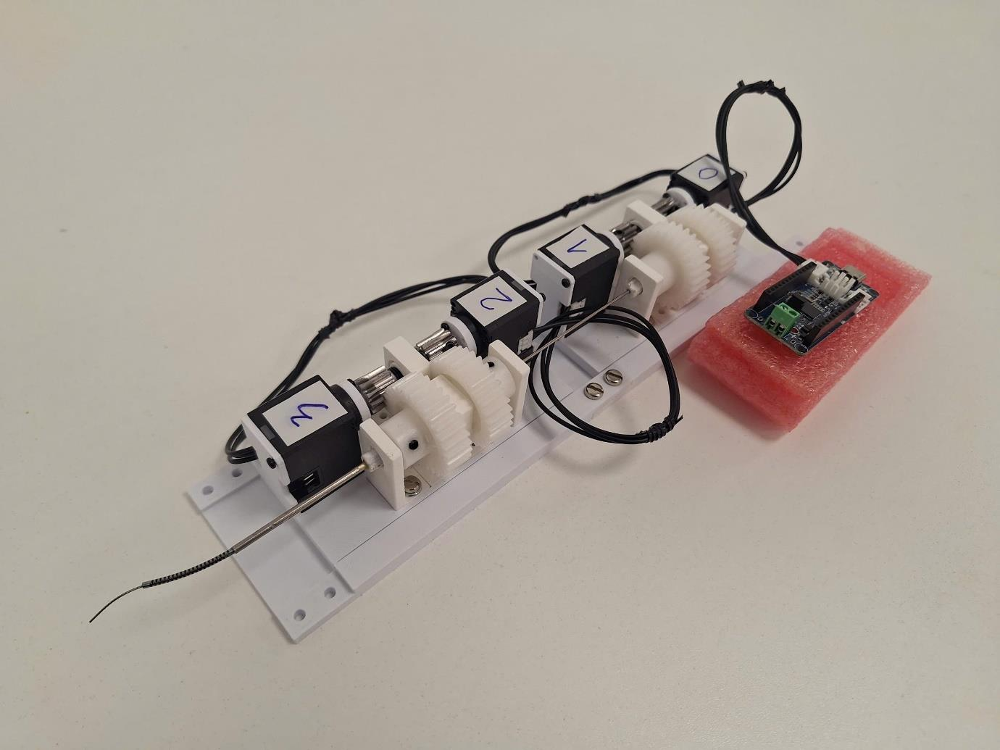
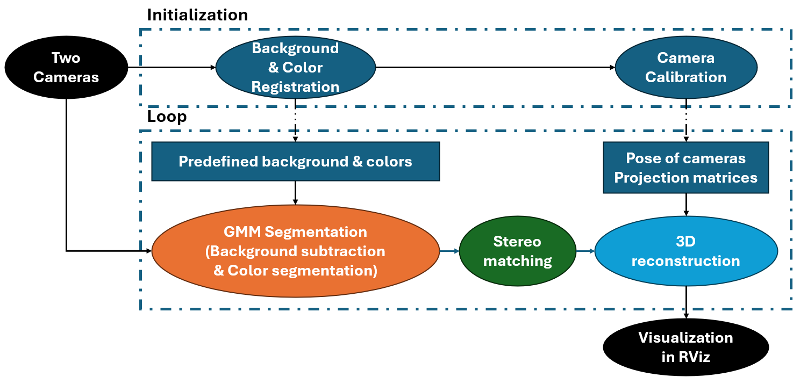
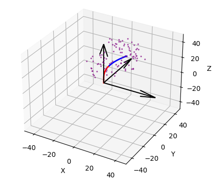

# Concentric Tube Robot – A Modular Design for Achieving Two Controllable Sections and a Stereo Tracking System

This is my thesis for my MSc at King's College London. It was a fun project. I have included the poster and the final report in the repository.

I accomplished two main tasks in my thesis:

+ **Design and manufacture a concentric tube robot** (Yes, an entire robot—but it's a small one, haha). This involved conducting finite element analysis to design and manufacture the tube, as well as designing, 3D printing, and assembling an actuation system (both mechanical and electrical). All the information can be found in the report.

+ **3D tracking of the entire robot:** Basically, I set up a camera system and developed an algorithm for tracking it. This is the coding part, which is why I created this repository.

## 3D Tracking Algorithm

Due to time constraints, I developed the algorithm using only traditional computer vision approaches: [Gaussian Mixture Models-based background subtraction and color segmentation](https://www.researchgate.net/publication/283026260_Background_subtraction_based_on_Gaussian_mixture_models_using_color_and_depth_information), together with [epipolar geometry](https://en.wikipedia.org/wiki/Epipolar_geometry).

The algorithm is shown here (It's simple, but I developed it, so I just want to share it):

It's a naive approach. First, you place a checkerboard in front of the camera, which helps the computer determine the orientation of the camera pose in the 3D world. Then, for each iteration, you segment the tube (by removing the background and identifying the tube color). For each point in the first image, I perform simple linear stereo matching to find the corresponding point in the second image. I then use those pairs of points to reconstruct the 3D coordinates.

### Set Up

I run the algorithm on ROS (Robot Operating System) on a Linux machine. I chose ROS because it's a standard robotics framework, and I selected Linux as we don't have much control over Windows anyway. In Linux, when connected to a camera, it writes the data to a location called `/dev/video0`.

The main code can be found in [`tracking_3D/src/camera/camera`](tracking_3D/src/camera/camera). If you are familiar with ROS, you will know how the camera package is set up. The main running code is `segment_tubes.py`, which imports all the modules from the files in the same folder. I wrote it with 100% unit test coverage for the small modules!

## Kinematics Simulation

[`kinematics_simulation`](kinematics_simulation) contains simplified kinematic models of the robots. Yes, it has 100% unit test coverage too. I think you can just download the whole folder and run `workspace_simulation.py`. It still works—I tested it, haha! I wrote it using Torch, NumPy, and Matplotlib, so you need to install them first using pip. (I used Torch because it keeps track of the computational graph, which I thought might be needed for some optimization techniques later on.)

## Final Word

I don't expect anyone to be able to use this; I just put it here as proof of an interesting period.
